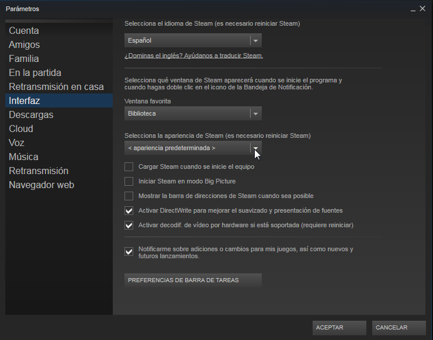
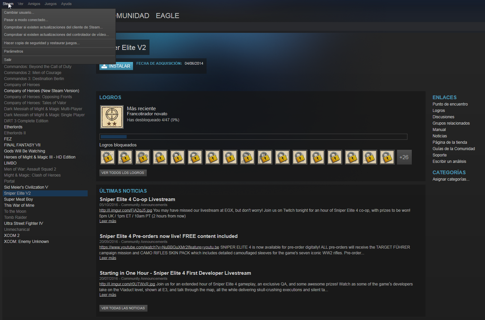
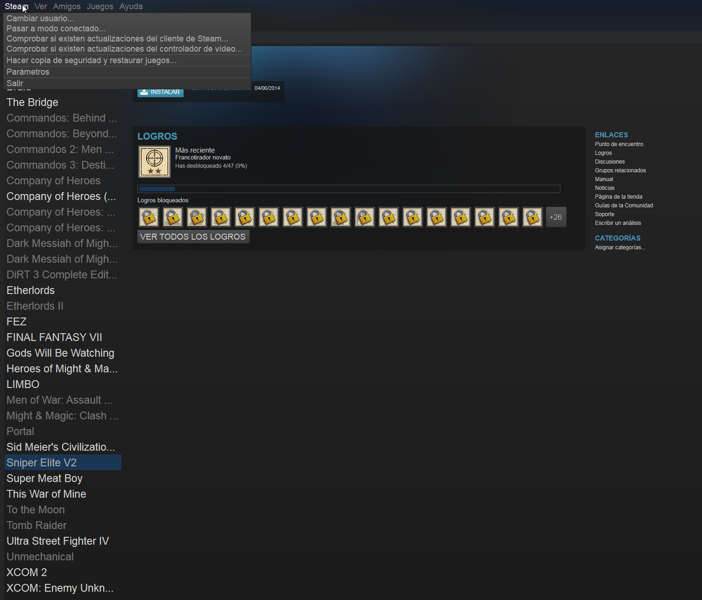
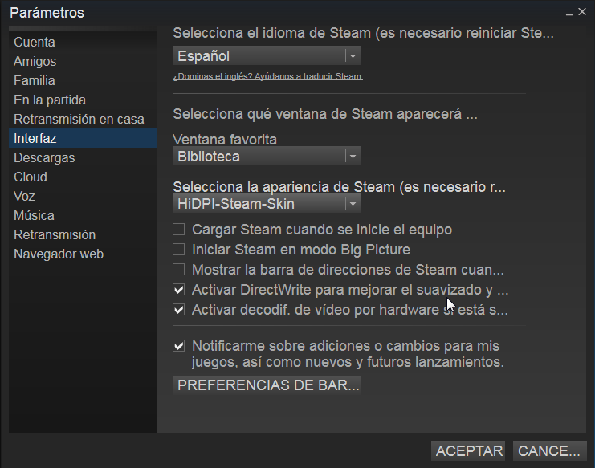

**DISCONTINUED: I GAVE UP ON THIS SKIN AND AM BACK ON WINDOWS FOR MY GAMING.**


What is this?
=============

This is a simple skin for Steam that gives everything a slightly larger font size.

I'm using Steam on Ubuntu with a HiDPI display and the original skin really sucks with hardcoded font sizes and no way to resize everything. Steam is not using the UI scale factor that I set via Ubuntus control panel, so I had to start this theme.

I'm not quite sure how portable this is, so if you find something that breaks your set up, please open an Issue here on Github. If you want to contribute, feel free to open a pull request with your changes.

Installation
------------

````
cd ~/.steam/skins
git clone https://github.com/MoriTanosuke/HiDPI-Steam-Skin.git
````

Open Steam, go to Settings -> Interface and choose the new skin `HiDPI-Steam-Skin`.

The exact path to the skins might be different in your installation. You might want to check `~/.local/share/Steam/skins/`, `~/.steam/skins` or `~/.steam/steam/skins`.

Screenshots
-----------

Here are some screenshots provided by @mcvendrell 





